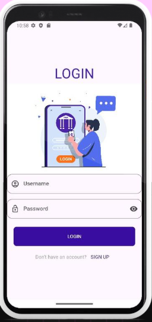
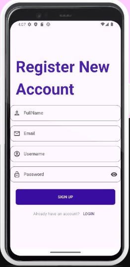
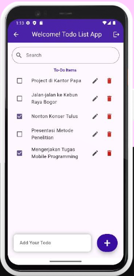

# 📝 Flutter Todo App

A simple and modern Todo List application built using Flutter.  
This application helps users manage daily tasks efficiently with a clean and responsive user interface.

---

## ✨ Features

- ➕ Add new tasks
- ✏️ Edit tasks
- ✅ Mark tasks as completed
- 🗑️ Delete tasks
- 💾 Local data storage using SQLite
- 📱 Responsive mobile design

---

## 🛠️ Technologies Used

- Flutter
- Dart
- SQLite (`sqflite`)
- Path Provider

---

## 📂 Project Structure

```bash
lib/
├── components/
├── controller/
├── db/
├── helper/
├── views/
└── main.dart
```

---

## 🚀 Getting Started

### 1️⃣ Clone Repository

```bash
git clone https://github.com/username/flutter-todo-app.git
```

### 2️⃣ Open Project Folder

```bash
cd flutter-todo-app
```

### 3️⃣ Install Dependencies

```bash
flutter pub get
```

### 4️⃣ Run Application

```bash
flutter run
```

---

## 📸 Application Screenshots

### 🔐 Authentication Page


### 🔑 Login Page



### 📝 Sign Up Page



### 👤 Profile Detail Page


### ✅ Main Todo Page



---

## 🎯 Project Purpose

This project was created as a learning implementation of Flutter mobile application development and local database management using SQLite.

---

## 👨‍💻 Author

**Luthfia Rosmala Dewi**  
Information Systems Student

---

## ⭐ Support

If you like this project, don't forget to give it a ⭐ on GitHub!
